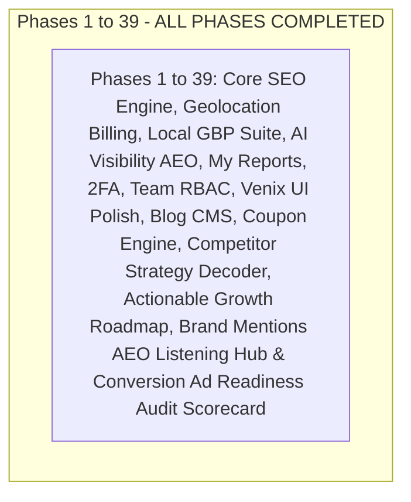

# Master SaaS Implementation Plan: OpenSEO & Skorvia Transformation (Complete Enterprise Roadmap)

> **Role & Persona:** Principal Full-Stack Architect (20+ Years Experience in Distributed Systems, TypeScript, React/Vite, Cloudflare Workers, Tailwind CSS, and Drizzle ORM).
> **Goal:** Transform Skorvia into a market-leading, enterprise-grade commercial SEO, AEO, Local Business, Brand Credibility, and Search Intelligence SaaS with 100% visual fidelity to the Venix Responsive Admin Dashboard Template.

---

## ⚠️ Core Engineering Directives for the AI Assistant

1. **Strict Sequential Execution:** Implement one phase at a time. Run type checks (`pnpm types:check` / `tsc --noEmit`) and verify functionality before proceeding to the next phase.
2. **Zero Breaking Changes:** Preserve existing DataForSEO integration, SERP scraper, site audit engine, `/mcp` endpoints, and all previously completed features from Phases 1 to 34.
3. **Strict Template Fidelity:** Strictly use the **Venix Responsive Admin Dashboard Template** typography (Inter / Plus Jakarta Sans), container layout, Solar Duotone icons, and dual-theme stylesheets (`skorvia` Light / `skorvia-dark`) for ALL admin and user dashboard routes.
4. **No Hallucinated Packages:** Rely strictly on existing `package.json` dependencies or standard project libraries (`drizzle-orm`, `zod`, `@better-auth/core`, `resend`, `lucide-react`, `@iconify/react`).
5. **Clean Separation of Concerns:**
   - Architecture Pattern: **TanStack Server Function $\rightarrow$ Service $\rightarrow$ Drizzle Repository**.
   - Dual-database compatibility for both SQLite (D1) and PostgreSQL.

---

## 🗺️ Master Project Roadmap (Phases 1 to 39)

---

## 📜 PHASES 1 TO 34 (COMPLETED & PRESERVED)

* **Phases 1 to 15:** Core branding, Drizzle schemas, multi-gateway billing, caching layer, growth features, user dashboard, auth, onboarding, notifications, translation, Local SEO, AI visibility, and reports.
* **Phases 16 to 22:** Global system settings, user management, impersonation, RBAC, dynamic pricing, blog CMS base, monitoring logs.
* **Phases 23 to 26:** 2FA TOTP, device alerts, hierarchical team management, monetization meters, cancellation retention, and Monday digests.
* **Phases 27 to 33:** Public marketing website elevation, Semrush-grade mega-menus, currency dropdown, solution pages, and verification suites.
* **Phase 34:** Complete Venix UI alignment, rich-text Blog CMS, real file uploads, granular plan feature matrix, and dynamic OpenRouter/Claude/Mistral model selector in Admin API settings.

---

## 🎟️ Phase 35: Coupon & Promotional Discount Code Engine

### 35.1 Objectives
Enable promotional discount campaigns (e.g. `LAUNCH50`, `BLACKFRIDAY`, `AGENCY20`) with instant validation and dynamic pricing calculation across USD and NGN checkout flows.

### 35.2 Admin Control (`/admin/plans` $\rightarrow$ Coupons Tab)
- Full CRUD table: Code, Discount Type (`percentage` vs `fixed_amount`), Value, Currency (`USD`/`NGN`), Max Redemptions, Times Redeemed, Expiry Date, Active Toggle.
- Create / Edit modal with input validation and instant state updates.

### 35.3 Customer Checkout Flow (`/billing`)
- Interactive "Have a coupon code?" input on plan checkout modal.
- 1-click validation endpoint (`validateCouponServerFn`).
- Real-time animated discount display (e.g. ~~\$49/mo~~ $\rightarrow$ **\$24.50/mo**) passed directly to payment gateways (Flutterwave, Paystack, LemonSqueezy).

### 35.4 Technical Architecture
- **Schema:** `src/server/db/schema/coupons.ts` (Drizzle table `saas_coupons`).
- **Service:** `src/services/coupons.service.ts`.
- **Server Function:** `src/serverFunctions/coupons.ts`.

---

## 🕵️ Phase 36: Competitor Strategy Decoder

### 36.1 Objectives
Translate raw competitor keyword and backlink metrics into an actionable, executive-level **5-Pillar Battle Plan**.

### 36.2 The 5 Strategic Pillars
1. **Positioning Stance & Core Hook:** How the rival sells, their main promise, and who they target.
2. **Paid Ads & Funnel Angles:** Primary value drivers, pricing friction, and conversion hooks.
3. **Content Moat (80/20 Rule):** The top 3–5 core content themes driving 80% of their organic traffic.
4. **Vulnerabilities & Strategic Gaps:** Weak keywords on page 2/3 and outdated content.
5. **"The Attack Playbook":** 3 concrete, prioritized plays to outrank and out-convert them.

### 36.3 1-Click SAM AI Execution
- Next to Play #1 (e.g. *"Create 'YourBrand vs Rival' comparison page"*), a button **`[ ⚡ Execute with SAM AI ]`** opens SAM with the complete strategy context preloaded.

### 36.4 Technical Architecture
- **Schema:** `src/server/db/schema/competitor_strategy.ts` (caches reports per project and domain).
- **Service:** `src/services/competitor-strategy.service.ts` (combines DataForSEO domain footprint + OpenRouter LLM).
- **UI:** `/p/$projectId/domain` and `/p/$projectId/competitors`.

---

## 📋 Phase 37: Actionable SEO & Growth Roadmap

### 37.1 Objectives
Transform technical audit data and competitor discoveries into a prioritized, sprint-based **Action Roadmap** with hybrid 3-way verification to eliminate dashboard overwhelm and slash SaaS churn.

### 37.2 Smart Priority Filters (No Rigid Day Buckets)
- Filter tabs: `[ All Tasks ]` | `[ ⚡ Quick Wins (< 5m) ]` | `[ 🔥 High Impact ]` | `[ 🛠️ Technical ]` | `[ ✍️ Content & Gaps ]`
- Task cards displaying impact badges (`High Impact`, `Quick Win`, `Growth Play`), estimated time to fix, and category.

### 37.3 The 3-Way Hybrid Verification Engine
1. **⚡ 1-Click AI Fix:** Click *"Fix with SAM AI"* $\rightarrow$ AI generates Schema JSON-LD, meta tags, or redirect rules and auto-completes the task.
2. **🔄 Autonomous Live Crawl Auto-Detect:** When a scheduled or manual re-crawl runs, Skorvia detects live website fixes (e.g. fixed 404s, newly added H1 tags) and automatically marks the task as **`✅ Live Verified`** with an animated health score bump.
3. **✓ Manual Checkbox:** For qualitative or offline tasks.

### 37.4 Technical Architecture
- **Schema:** `src/server/db/schema/roadmap_tasks.ts`.
- **Service:** `src/services/roadmap.service.ts`.
- **UI:** `/p/$projectId/roadmap` and Project Overview dashboard widget.

---

## 📢 Phase 38: Brand Mentions & AEO Listening Hub

### 38.1 Objectives
Scan the web for unlinked brand mentions to claim high-authority backlinks and track brand sentiment across AI search engines (ChatGPT, Claude, Perplexity, Google AI Overviews).

### 38.2 Core Capabilities
1. **Unlinked Mention Backlink Claim:** Identifies websites that wrote about the brand without a hyperlink $\rightarrow$ generates a 1-click personalized email pitch to claim a `dofollow` backlink.
2. **AEO & LLM Search Sentiment Tracking:** Evaluates how AI models characterize the brand and highlights missing entity citations.

### 38.3 Technical Architecture
- **Schema:** `src/server/db/schema/brand_mentions.ts`.
- **Service:** `src/services/brand-mentions.service.ts`.
- **UI:** `/p/$projectId/brand-mentions`.

---

## 🎯 Phase 39: Conversion & Ad Readiness Audit Scorecard

### 39.1 Objectives
Provide a companion **Conversion & Ad Readiness Score (0–100)** alongside the Technical SEO Health Score to ensure traffic converts profitably and prevent wasted ad spend on unready pages.

### 39.2 Core Capabilities
- Audits landing page credibility, trust badges, SSL/schema verification, CTA clarity, and social proof signals.
- Generates a conversion friction warning with 1-click fixes before users scale ad campaigns.

### 39.3 Technical Architecture
- **Schema:** Extended `project_audits.ts`.
- **Component:** `src/client/features/overview/AdReadinessScoreWidget.tsx`.

---

## 🧪 Global Verification & Quality Gates

1. **TypeScript Compilation:** `pnpm types:check` (`tsc --noEmit`) must exit with code 0 at every phase.
2. **Linting & Code Standards:** Strict adherence to ESLint, Prettier, and project conventions.
3. **Zero Breaking Changes:** Preserve all existing database tables, API routes, and user settings.
